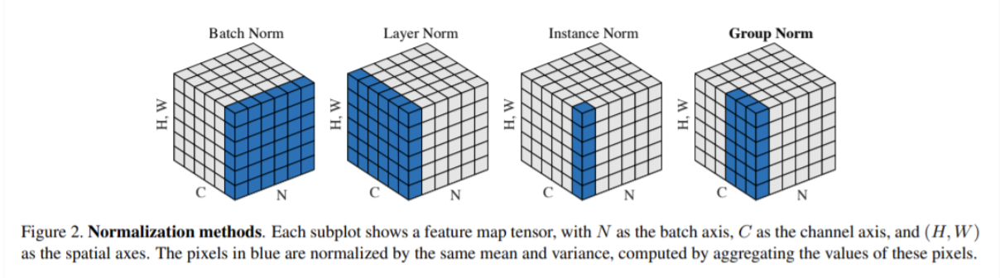

**1、大模型微调如何选择基座？**

* 语言的支持性
* 预训练语料与垂直领域的相关性
* 计算资源、模型性能等

**2、llm训练细节**

* PT：自监督训练，通常会先将数据集切成固定长度的序列，然后做非padding token的自回归或者填空任务；输入包括词向量编码+位置编码+(其它编码，如bert子句编码)
* SFT：序列生成监督训练，一般decoder-only架构的模型不需要添加valuehead
* RM：排序的有监督训练，通常将prompt和response拼接输入模型，然后对比chosen与rejected两个序列，取首个token不同的位置到两个序列最大有效长度的位置的值（valuehead）--即每个token有一个分数，作为计算奖励分数的依据
* DPO：直接偏好优化，
* PPO：近端策略优化

**3、如何让llm具备工具调用能力**

* 首先得有一个工具库，而后需要训练llm根据工具库和目标任务选择工具并调用工具返回结果的能力。关键的地方在于模型要学会针对任务选择工具，并且正确的调用工具，必要时候需要将复杂任务分解为多个子任务。

**4、llm训练的scaling law**

* 对于基于transformer的语言模型，假设模型的参数量为N，数据集tokens数量为D，那么模型的总计算量$C \approx 6\cdot N\cdot D$。模型的计算量C（一般用PF-days度量）确定后，模型的性能即精度就基本确定，因此影响模型性能的因素就只有N和D，跟模型的具体结构如深度、宽度等基本无关。
* openai提出的浮点运算量C、模型参数N以及训练的token数D之间的最优组合：

  $$
  N \propto C^{0.73}  \\
  最优batch\_size \quad B \propto C^{0.24}  \\
  最优训练步数 \quad S \propto C^{0.03}
  $$
* 补充：“PF”代表PetaFLOPS（千万亿次浮点运算每秒），而“days”则表示天数。如果一个任务需要1 PFLOPS的连续计算能力来完成，并且这个任务总共耗时1天，则称该任务的工作负载为1 PF-day。TFLOPS（TeraFLOPS，万亿次浮点运算每秒）是PFLOPS的小一级单位，1 PFLOPS等于1024 TFLOPS。
* 举例：如果模型的参数量为1e3，token数为1e9，那么预估达到收敛需要的总计算量为$6\times 10^{12}$Flops，即$7\times 10^{-8}$PF-days。

**5、prefix LLM和causal LLM的区别**

* prefix LLM：生成模型，生成每个词时可以考虑上下文信息，适合机器翻译、文本理解等任务；
* causal LLM：自回归模型，生成每个词时只能够看见之前位置的内容，适合文本生成、语言建模等任务

**6、什么是LLM的涌现，为什么会出现涌现**

* 涌现指LLM未经直接训练，却突然而且不可预测地出现的能力，主要体现在few-shot的任务上
* 有人认为是数据量、计算能力、模型参数等增加到一定程度后，LLM出现了涌现；也有人认为是因为现有评价指标的不完善、不连续，无法很好评估大模型的能力，所以将这些指标无法体现的能力称之为涌现。

**7、介绍一下GPT和BERT，以及两者的区别**

* BERT：Encoder-only的架构，通过填空任务进行预训练；更适合做文本理解、翻译等任务
* GPT：Decoder-only的架构，通过预测下一个token进行预训练；更适合文本生成类的任务

**8、Transformer和LSTM的结构与原理**

* LSTM：RNN的一种变体，主要是为了解决RNN的长程依赖问题（并没有完全解决，只是一定程度减弱），它包括三个门口神经单元，分别为输入门、遗忘门、输出门。输入门（input gate）：控制新信息的输入程度，遗忘门（forget gate）：控制过去信息（$c_t$）的遗忘程度，输出门（output gate）：决定当前时刻的输出。
* Transformer：核心组件包括位置编码、多头自注意力机制
  * 位置编码：$\text{PositionalEncoding}(pos, 2i) = \sin\left(\frac{pos}{10000^{2i/d_{\text{model}}}}\right)$;  $\text{PositionalEncoding}(pos, 2i+1) = \cos(\frac{pos}{10000^{2i/d_{\text{model}}}})$
  * 自注意力：注意力权重矩阵 $A = \text{softmax}\left(\frac{QK^T}{\sqrt{d_{\text{key}}}}\right)$; $\text{SelfAttention}(X) = AV$ 
  * 为什么要乘以$\frac{1}{\sqrt{d_k}}$：Q和K直接相乘的值容易落入softmax的饱和区域，导致梯度很小，收敛困难

**9、BN和LN的区别**

* BN：同一个批次内，所有样本在同一个特征维度上做标准化
* LN：同一个样本内，所有特征做标准化

**10、LLM的参数量计算**

* self-attention块：$W_Q, W_K, W_V, W_O$都是$(d_{model}, d_{model})$的，然后对应的偏置是$(d_{model},)$的，所以self-attention的参数量是$4d^2_{model}+4d_{model}$。
* MLP块：第一个线性层是先将维度从$d_{model}$映射到$4d_{model}$，第二个线性层再将维度从$4d_{model}$映射到$d_{model}$。MLP块的参数量为$8d^2_{model}+5d_{model}$。
* LN：self-attention和MLP块都有一个LN，包含一个缩放参数和一个平移参数，所以参数量为$4d_{model}$。
* Word-Embeding：$V_{vocab} \cdot d_{model}$
* 总的参数量：$l(12d^2_{model} + 13d_{modle}) + V_{vocab}\cdot d_{model} \approx 12\cdot l \cdot d^2_{model}$

**11、GPT、GLM和llama模型结构**

* GPT：只是用了Decoder，并且去除了其中的第二个注意力块

  
* llama v.s. GPT

  * 改用RoPE旋转位置编码，并且嵌入的位置不再是GPT-3中的输入层，llama是把RoPE在每一层self-attention中都嵌入
  * Norm层不再使用GPT-3中的layernorm，改换成RMSNorm，计算效率更高：$\frac{x}{\sqrt{\bar{x^2}+\epsilon}} \cdot W + B$
  * FFN中的激活函数不再是Relu，llama改用成SwiGLU
* llama2 v.s. llama

  * MHA改成GQA：整体参数量减少
    
* GLM
