**1、大模型微调如何选择基座？**

* 语言的支持性
* 预训练语料与垂直领域的相关性
* 计算资源、模型性能等

**2、llm训练细节**

* PT：自监督训练，通常会先将数据集切成固定长度的序列，然后做非padding token的自回归或者填空任务；输入包括词向量编码+位置编码+(其它编码，如bert子句编码)
* SFT：序列生成监督训练，一般decoder-only架构的模型不需要添加valuehead
* RM：排序的有监督训练，通常将prompt和response拼接输入模型，然后对比chosen与rejected两个序列，取首个token不同的位置到两个序列最大有效长度的位置的值（valuehead）--即每个token有一个分数，作为计算奖励分数的依据
* DPO：直接偏好优化，
* PPO：近端策略优化

**3、如何让llm具备工具调用能力**

* 首先得有一个工具库，而后需要训练llm根据工具库和目标任务选择工具并调用工具返回结果的能力。关键的地方在于模型要学会针对任务选择工具，并且正确的调用工具，必要时候需要将复杂任务分解为多个子任务。

**4、llm训练的scaling law**

* 对于基于transformer的语言模型，假设模型的参数量为N，数据集tokens数量为D，那么模型的总计算量$C \approx 6\cdot N\cdot D$。模型的计算量C（一般用PF-days度量）确定后，模型的性能即精度就基本确定，因此影响模型性能的因素就只有N和D，跟模型的具体结构如深度、宽度等基本无关。
* openai提出的浮点运算量C、模型参数N以及训练的token数D之间的最优组合：

  $$
  N \propto C^{0.73}  \\
  最优batch\_size \quad B \propto C^{0.24}  \\
  最优训练步数 \quad S \propto C^{0.03}
  $$
* 补充：“PF”代表PetaFLOPS（千万亿次浮点运算每秒），而“days”则表示天数。如果一个任务需要1 PFLOPS的连续计算能力来完成，并且这个任务总共耗时1天，则称该任务的工作负载为1 PF-day。TFLOPS（TeraFLOPS，万亿次浮点运算每秒）是PFLOPS的小一级单位，1 PFLOPS等于1024 TFLOPS。
* 举例：如果模型的参数量为1e3，token数为1e9，那么预估达到收敛需要的总计算量为$6\times 10^{12}$Flops，即$7\times 10^{-8}$PF-days。

**5、prefix LLM和causal LLM的区别**

* prefix LLM：生成模型，生成每个词时可以考虑上下文信息，适合机器翻译、文本理解等任务；
* causal LLM：自回归模型，生成每个词时只能够看见之前位置的内容，适合文本生成、语言建模等任务

**6、什么是LLM的涌现，为什么会出现涌现**

* 涌现指LLM未经直接训练，却突然而且不可预测地出现的能力，主要体现在few-shot的任务上
* 有人认为是数据量、计算能力、模型参数等增加到一定程度后，LLM出现了涌现；也有人认为是因为现有评价指标的不完善、不连续，无法很好评估大模型的能力，所以将这些指标无法体现的能力称之为涌现。

**7、介绍一下GPT和BERT，以及两者的区别**

* BERT：Encoder-only的架构，通过填空任务进行预训练；更适合做文本理解、翻译等任务
* GPT：Decoder-only的架构，通过预测下一个token进行预训练；更适合文本生成类的任务

**8、Transformer和LSTM的结构与原理**

* LSTM：RNN的一种变体，主要是为了解决RNN的长程依赖问题（并没有完全解决，只是一定程度减弱），它包括三个门口神经单元，分别为输入门、遗忘门、输出门。输入门（input gate）：控制新信息的输入程度，遗忘门（forget gate）：控制过去信息（$c_t$）的遗忘程度，输出门（output gate）：决定当前时刻的输出。
* Transformer：核心组件包括位置编码、多头自注意力机制
  * 位置编码：$\text{PositionalEncoding}(pos, 2i) = \sin\left(\frac{pos}{10000^{2i/d_{\text{model}}}}\right)$;  $\text{PositionalEncoding}(pos, 2i+1) = \cos(\frac{pos}{10000^{2i/d_{\text{model}}}})$
  * 自注意力：注意力权重矩阵 $A = \text{softmax}\left(\frac{QK^T}{\sqrt{d_{\text{key}}}}\right)$; $\text{SelfAttention}(X) = AV$ 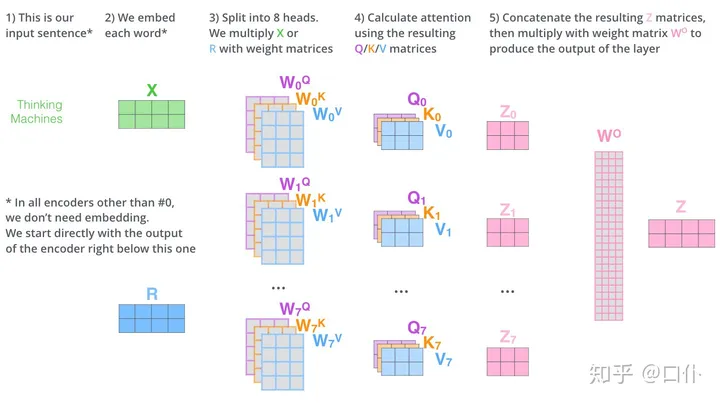
  * 为什么要乘以$\frac{1}{\sqrt{d_k}}$：Q和K直接相乘的值容易落入softmax的饱和区域，导致梯度很小，收敛困难
  * 为什么是$\frac{1}{\sqrt{d_k}}$，不是$\frac{1}{{d_k}^{\frac{2}{3}}}$或者其它的呢：
    * 首先**假设q和k都是服从期望为0，方差为1的独立的随机变量**。假设：X = q_i，Y = k_i，那么：
      1. $E(XY) = E(X)E(Y) = 0$ 
      2. $D(XY) = D(X)D(Y) = 1$
      3. $D(QK / \sqrt{d_k}) = \frac{d_k}{d_k} = 1$

      需要注意的是，$D(QK) = D(\sum_{i=0}^{dk}q_i \times k_i) = d_k \times 1 = d_k$

**9、BN和LN的区别**

* BN：同一个批次内，所有样本在同一个特征维度上做标准化
* LN：同一个样本内，所有特征做标准化  
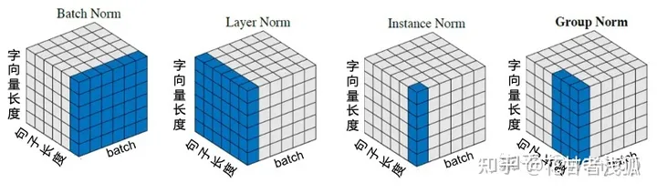

**10、LLM的参数量计算**

* self-attention块：$W_Q, W_K, W_V, W_O$都是$(d_{model}, d_{model})$的，然后对应的偏置是$(d_{model},)$的，所以self-attention的参数量是$4d^2_{model}+4d_{model}$。
* MLP块：第一个线性层是先将维度从$d_{model}$映射到$4d_{model}$，第二个线性层再将维度从$4d_{model}$映射到$d_{model}$。MLP块的参数量为$8d^2_{model}+5d_{model}$。
* LN：self-attention和MLP块都有一个LN，包含一个缩放参数和一个平移参数，所以参数量为$4d_{model}$。
* Word-Embeding：$V_{vocab} \cdot d_{model}$
* 总的参数量：$l(12d^2_{model} + 13d_{modle}) + V_{vocab}\cdot d_{model} \approx 12\cdot l \cdot d^2_{model}$

**11、GPT、GLM和llama模型结构**

* GPT：只是用了Decoder，并且去除了其中的第二个注意力块

  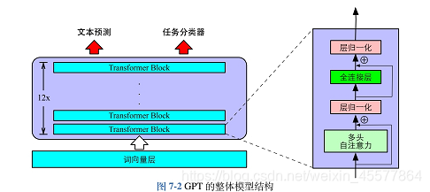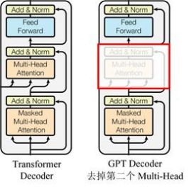
* llama v.s. GPT

  * 改用RoPE旋转位置编码，并且嵌入的位置不再是GPT-3中的输入层，**llama是把RoPE在每一层self-attention中都嵌入**
  * Norm层不再使用GPT-3中的layernorm，改换成RMSNorm，计算效率更高：$\frac{x}{\sqrt{\bar{x^2}+\epsilon}} \cdot W + B$
  * FFN中的激活函数不再是Relu，llama改用成SwiGLU
* llama2 v.s. llama

  * MHA改成GQA：整体参数量减少
    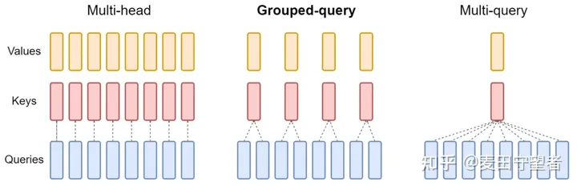
* GLM(General Language Model)
  
  * BERT和GPT进行区别设计，是因为他们主攻的下游任务不同，既想做NLG，又想做NLU，才有了GLMs
    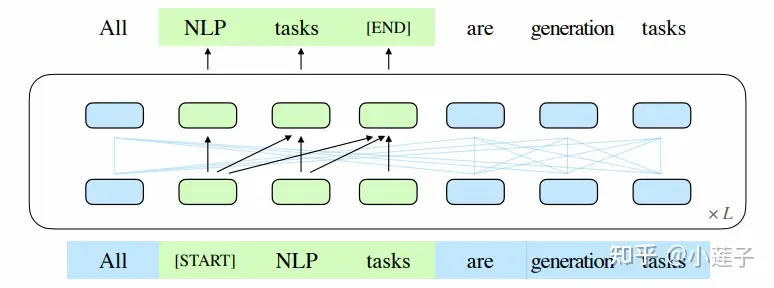

**12、LLM微调的方法有哪些**

* PEFT
    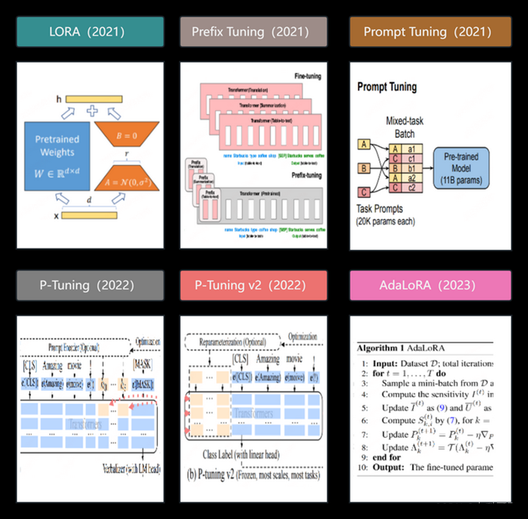
  * Prompt类：让模型自己生成prompt
    * prompt tuning：在输入层加一个embedding层  
    * P-tuning：在输入层加一个embedding和一个LSTM或MLP  
    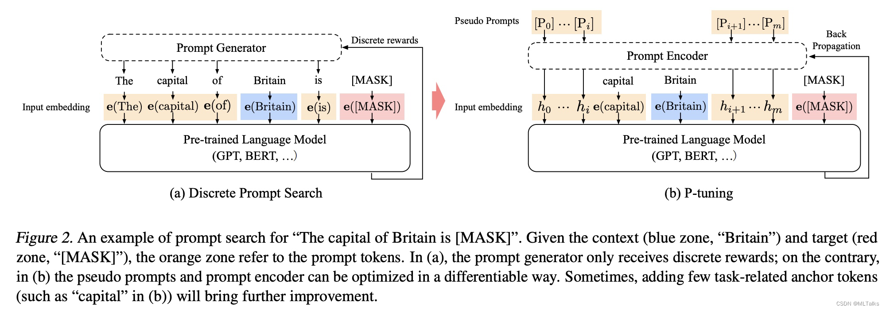
    * prefix tuning：在每一层加入一个embedding和一个MLP
    * P-tuning v2：在每一层都加一个embedding层
  * Adapter类
    * Adapter Tuning：针对每一个Transformer层，增加了两个Adapter结构(分别是多头注意力的投影之后和第二个feed-forward层之后)
    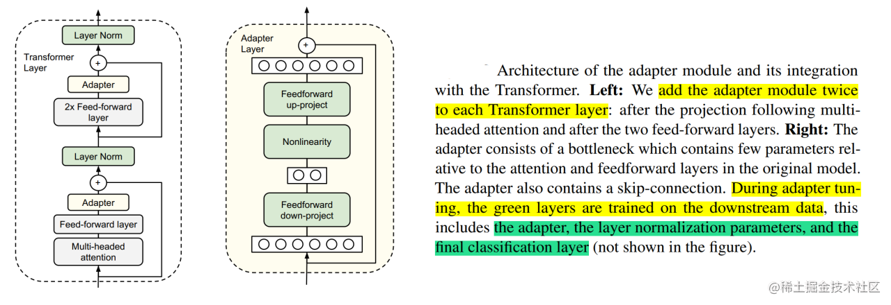
    * Adapter Fusion：在 Adapter 的基础上进行优化，通过将学习过程分为两阶段来提升下游任务表现：包括知识提取和知识组合。
      * 知识提取阶段：在不同任务下引入各自的Adapter模块，用于学习特定任务的信息。
      * 知识组合阶段：将预训练模型参数与特定于任务的Adapter参数固定，引入新参数（AdapterFusion）来学习组合多个Adapter中的知识，以提高模型在目标任务中的表现
    * Adapter Drop：在不影响任务性能的情况下，对Adapter动态高效的移除，尽可能的减少模型的参数量，提高模型在反向传播（训练）和正向传播（推理）时的效率
  * Lora类
    * LoRA：用两个低秩矩阵替代待更新的权重矩阵的增量。在原始预训练语言模型（PLM）旁边增加一个旁路，做一个降维再升维的操作，来模拟所谓的内在秩。训练的时候固定PLM的参数，只训练降维矩阵A与升维矩阵B。模型的输入输出维度不变，输出时将BA与PLM的参数叠加。随机高斯分布初始化A，用0矩阵初始化B，保证训练的开始此旁路矩阵依然是0矩阵。通过SVD分解来找到原权重矩阵的内在秩。$\alpha$的作用等同于学习率。
    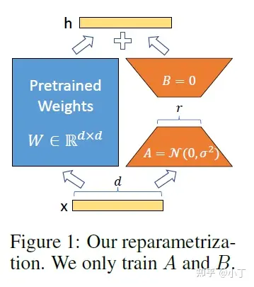
    * QLoRA：1. 使用4 bit NormalFloat(NF4) 量化；2. 双量化，包含对普通参数的一次量化和对量化后的参数的再一次量化，可以进一步减小缓存占用；3. 引入了分页优化器，在显存不够时候，将保存的部分梯度转移到CPU上，以防止梯度检查点期间的内存峰值。
    * AdaLoRA：用奇异值分解$P \Lambda Q$代替$AB$，根据loss梯度评估对角线上值进行重要性评分，根据评分动态分配参数预算给权重矩阵。
        1. AdaLoRA将关键的增量矩阵分配高秩以捕捉更精细和任务特定的信息，而将较不重要的矩阵的秩降低，以防止过拟合并节省计算预算。2. 以奇异值分解的形式对增量更新进行参数化，并根据重要性指标裁剪掉不重要的奇异值，同时保留奇异向量。3. 在训练损失中添加了额外的惩罚项，以规范奇异矩阵P和Q的正交性，从而避免SVD的大量计算并稳定训练。
    * ReLoRA：主要用于解决多个LoRA叠加训练时秩不增的问题，LoRA的微调精度受到式$rank(A+B)<=rank(A)+rank(B)$的限制，即我们用于加和更新的矩阵的秩最多也只是矩阵和的秩，而非矩阵秩的和，这会导致我们用于更新的信息量存在上限，从而影响我们的训练效果。解决的办法是重新启动LoRA，这意味着我们在训练期间合并WA和WB并重置这些矩阵的值，我们可以增加更新的矩阵的秩。

**13、nlp任务一般流程**  
* 原始文本 -> 分词 -> 清洗 -> 标注化 -> 词向量嵌入 -> 建模

**14、LLM的性能评价指标**
* 文本摘要：ROUGE
* 机器翻译：BLEU
* 通用能力评估：C-EVAL, MMLU, SuperGLUE

**15、bf16/fp16半精度训练的优缺点**
* bf16 用8bit 表示指数，7bit 表示小数；fp16用5bit 表示指数，10bit 表示小数。也就是说bf16 可表示的整数范围更广泛，但是精度较低；fp16 表示整数范围较小，但是精度较高。事实上，bf16就是google brain team为了深度学习而设计的数据类型，因为在深度学习中，我们更关心范围，而不是精度（这也是为什么量化很火），因为过参数本身就可以一定程度上弥补精度的损失。
* 半精度训练的优缺点及混合精度训练
  * 半精度训练优点：很直接的优势，就是跑得快+省显存
  * 半精度训练缺点：当然还是精度（下溢+舍入误差）的问题。
  * 当然，使用了半精度训练，一般会采用一些捆绑的技术来弥补半精度的缺点，所谓扬长避短。这些方法的合体可以叫做混合精度训练，具体如下：混合精度训练（或fake quantization）总体的策略是，同时有低精度和高精度的权重（现在讨论的是float16和float32），前向传播用低精度来算，反向传播的gradients也用低精度来算，但是在更新参数的时候更新的是高精度的参数。然后在下一次的前向传播之前，对这个更新后的高精度参数量化为低精度参数，再开启下一次前向传播。

**16、LLM微调数据集如何构造**
* 人工设计：领域内的专家设计一些高质量的promot-answer样本集
* 调用API：将领域内的一些文档（如pdf等）解析成文本，然后喂到大模型中，通过合适的prompt，让大模型生成对应的prompt-answer样本集。通常需要后处理，来提升数据集的质量。

**17、LLM推理加速**
* 所有的推理加速方法都会导致推理效果的下降，越是对结果要求严格的任务，效果下降越明显
* 推理加速的方法大致可以分为下面几类，可以参考 https://zhuanlan.zhihu.com/p/642412124：
  * 模型压缩
    * 模型参数量化：量化会降低显存需求，从而在推理阶段可以增加batch_size。但这样并不一定会提升推理速度，还要看底层硬件对整型计算的优化情况。
    * KV cache量化：模型的中间结果（如嵌入向量或梯度）被存储在键值对（Key-Value）的数据结构中。这些键值对会被缓存在内存中，以便在模型推理时快速访问。将中间计算结果（如激活函数的输出）量化，可以减少内存中存储的中间数据量，提高缓存的利用率，从而增加样本吞吐率，提升推理速度。
  * 底层优化
  * 解码方式优化
  * attention 优化

**18、RAG技术**
* 标准 RAG 方法：将文本分割成小块，然后使用某种 Transformer Encoder 模型将这些小块转换为向量，把这些向量汇总到一个索引中，最后创建一个针对大语言模型的提示，指导模型根据我们在搜索步骤中找到的上下文回答用户的查询。在实际运行中，我们用相同的 Encoder 模型将用户的查询转化为向量，然后对这个查询向量进行搜索，与索引进行匹配，找出最相关的前 k 个结果，从我们的数据库中提取相应的文本块，并将其作为上下文输入 LLM 进行处理。  
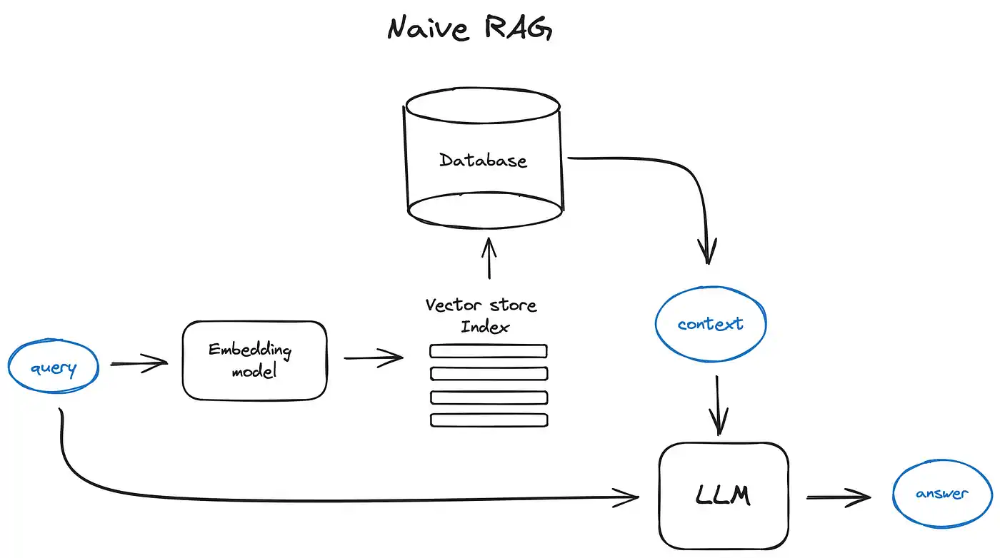

